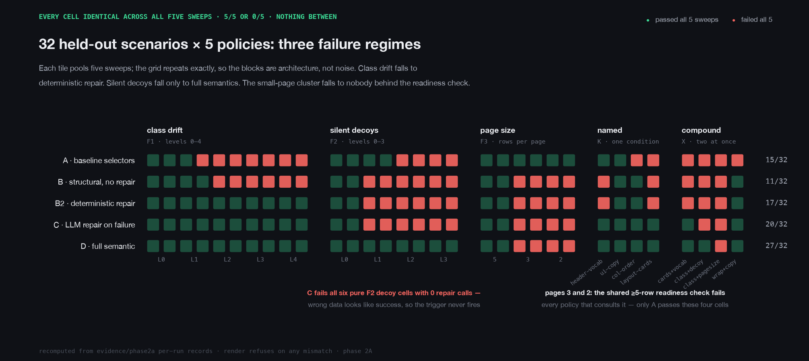
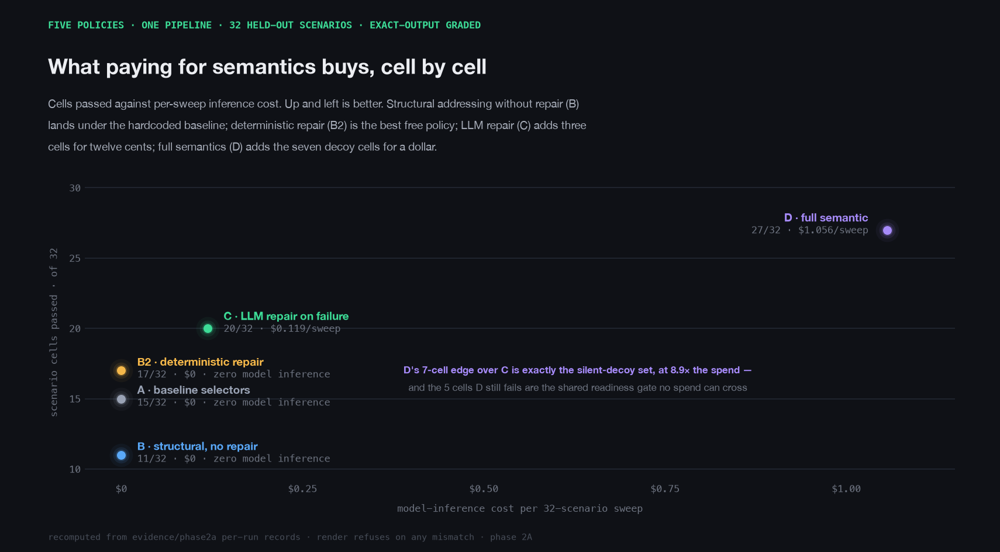
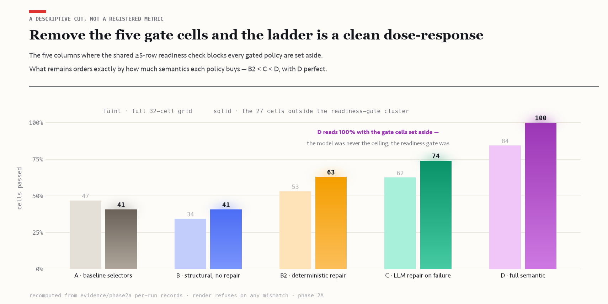

# semantic-escalation-bench

**When is web automation worth a model call?**

Selector scripts are free until the site changes. Then they crash, or
worse, keep running and quietly return the wrong data. An LLM driving
the browser can survive changes that break selectors, but every run
costs money. The obvious compromise is to run the cheap script and
wake the model when something breaks.

That plan rests on one assumption: **you can tell when something
broke.**

This repo tests that assumption. Five automation policies ran the same
pipeline against pages that break in controlled ways: 800 graded
trials, exact ground truth, zero flaky results. Three findings:

- **When breakage is visible, escalation is a bargain.** Calling the
  model only on failure matched the full LLM agent 120/120 on the first
  campaign's suite, at 8.61× lower inference cost.
- **When breakage is silent, the trigger never fires.** Served a
  plausible wrong page, the escalation policy extracted wrong data with
  zero model calls. It never learned anything was wrong.
- **Four tests were passed by exactly one policy: the $0 hardcoded
  script.** A readiness check buried in the harness failed every other
  policy before the model was allowed to look at the page. The full LLM
  agent burned 10 model calls per trial repairing a page that was never
  broken.

That last one was in nobody's plan. The test suite was written by a
different frontier model that registered a pass/fail prediction for
every cell in advance. It went 141 for 160, and all 19 misses were that
readiness check.

## Five policies, one variable

One pipeline: log in, navigate, extract a stats table into strict JSON,
grade the output against exact ground truth. Five frozen policies run
it, from dumbest to smartest. They differ in exactly one thing, the
addressing-and-repair policy: how the automation finds things on the
page, and when, if ever, the model is allowed to act.

| Policy | How it finds things on the page | When the model acts |
| --- | --- | --- |
| **A** baseline | hardcoded ids and column positions | never |
| **B** structural | cached actions + header-name mapping | never |
| **B2** deterministic repair | B, plus a scripted repair ladder on failure | never |
| **C** LLM repair | B, plus one model-powered repair per broken step | only on failure |
| **D** full semantic | the model reads and drives every semantic step | every step |

("Cached actions" are saved selector steps replayed with zero model
calls; "header-name mapping" finds columns by their header text instead
of their position.)

Model, task, site, ground truth, and validation are all held fixed, so
when two policies score differently, the policy is the reason. Built on
[Stagehand](https://github.com/browserbase/stagehand) +
[Browserbase](https://browserbase.com) against a local synthetic site,
so the whole benchmark is reproducible and nothing real gets scraped
(see [Safety & compliance](#safety--compliance)).

## How it was kept honest

Benchmarks are easy to accidentally rig, so this one was run
adversarially:

1. The five policies were frozen and git-tagged before any paid trial
   ran.
2. Only then did an external frontier model (GPT-5.6, "sol") write the
   32-scenario test suite. Held out, so nothing could be tuned to it.
3. The same model registered a pass/fail prediction for every cell (a
   cell = one scenario for one policy) before a single trial ran.
4. 32 scenarios × 5 policies × 5 repeat sweeps = 800 trials, and every
   cell landed identically in all five sweeps. Every score below is a
   5/5 or a 0/5, not an average.

An earlier campaign, Phase 1 (384 trials, protocol frozen at tag
`protocol-freeze-v4`), established the cost result but hit a ceiling:
every paid policy passed everything, so it could not separate
repair-on-failure from full semantics. Phase 2A exists to fix that.
[docs/PHASE1_RESULTS.md](docs/PHASE1_RESULTS.md) ·
[docs/PHASE2A_RESULTS.md](docs/PHASE2A_RESULTS.md)

## The scoreboard

A cell is one scenario for one policy, pooled over five sweeps:

| Policy | Cells passed | Per-sweep cost | Per successful workflow |
| --- | ---: | ---: | ---: |
| A baseline | 15/32 | $0 | n/a |
| B structural | 11/32 | $0 | n/a |
| B2 deterministic repair | 17/32 | $0 | n/a |
| C LLM repair on failure | 20/32 | $0.119 | $0.0060 |
| D full semantic | 27/32 | $1.056 | $0.0391 |

Costs are model inference only; A, B, and B2 make zero model calls.



## What it found

**1. When breakage is visible, repair-on-failure is the bargain.**
Policy C calls the model only when a step fails. In Phase 2A that
recovered three cells beyond deterministic repair (header vocabulary
drift, a card-grid redesign, and both at once) for about $0.006 per
successful workflow. Phase 1 said it louder: C matched full-semantic D
120/120 judged-correct on that frozen suite, at 8.61× lower inference
cost ($0.0036 vs $0.0312 per successful workflow). You don't need the
model driving. You need it on call.

**2. When breakage is silent, the repair trigger never fires.** Decoy
scenarios render plausible wrong content alongside the real thing. C's
cached actions "succeed", extraction returns the wrong rows (one decoy
trial graded 0.71 field accuracy against the required 1.00, with no
error raised anywhere), and C fails all six pure decoy cells with
**zero LLM calls**. It never learns anything went wrong. D reads the
page every step and passes all of them. That is what D's 8.9× per-sweep
premium actually buys: catching failures that don't look like failures.
And in the one compound cell where C's repair did fire, it healed the
broken selector and the trial still failed. Repair fixes locators, not
meaning.



**3. The gate is the policy.** One shared readiness check treats a
stats table as "ready" only once it shows at least 5 rows. Serve a
perfectly valid 3- or 2-row page and every policy above the baseline
fails identically: deterministic repair finds nothing to reveal, C aims
its one repair call at a control that does not exist, and D burns 10
calls per trial and still fails. The failure happens before the model
is allowed to see the page. Only the $0 baseline passes those four
small-page cells, because it never consults the check. (A fifth,
compound gate cell also strips A's login hooks; there the whole ladder
goes 0/5.) Of the 27 cells outside this cluster, D passes all 27. The
model was never the ceiling here. A harness assumption was.



**4. The suite author called 141 of 160 cells in advance, and all 19
misses were the same bug.** The registered predictions got the baseline
exactly right and missed only the readiness-gate cluster nobody knew
existed. That is what held-out testing is for: the misses pile up
exactly where your model of the system is wrong. One more upset from
the grid: structural addressing without any repair path (B) scored
below the hardcoded baseline, 11 cells to 15. Structure buys nothing
under drift until something can repair it.

## Check every number yourself

No API key needed. All 800 per-trial records ship in
[evidence/phase2a/](evidence/phase2a/README.md), checksummed. A frozen
verifier re-checks schema, provenance, completeness, and grading, and
reprints the prediction scorecard:

```bash
pnpm verify:suite evidence/phase2a/runs/* \
  --suite data/phase2a/scenario-suite.json \
  --expect-policies A,B,B2,C,D --expect-trials 5
```

The three charts regenerate from the same records and refuse to render
if anything disagrees with the published figures:

```bash
python3 -m venv .venv && .venv/bin/pip install matplotlib
.venv/bin/python scripts/render-phase2a-charts.py
```

**Deliberately narrow.** One model, one synthetic local site, one task
family, one frozen 32-scenario suite. This measures where semantic
inference belongs in an automation stack, not general agent ability.
Full per-axis metrics, the readiness-gate anatomy, cost accounting, and
the network incident that forced a full restart of the paid runs:
[docs/PHASE2A_RESULTS.md](docs/PHASE2A_RESULTS.md) · design contract:
[docs/PROTOCOL_2A.md](docs/PROTOCOL_2A.md).

## Why a fake sports league

The domain is arbitrary. The properties are not. A league table is
dense, typed, relational data with built-in arithmetic (games played
must equal wins + draws + losses), which gives the deterministic
validator real teeth. A seeded fake league means exact per-cell ground
truth, so "correct" is measured, not guessed. And sports pages break
automation in unusually well-documented ways: every chaos flag in the
lab maps to a cited real-world incident in
[docs/EVIDENCE.md](docs/EVIDENCE.md), including a real baseballr fix
for a mid-table column insertion that silently mislabeled stats, which
is this suite's column-shuffle scenario observed in production. The
findings don't depend on the domain; the measurability does. Everything
runs against `localhost`.

## Quickstart

Prerequisites: **Node 20+**, **pnpm 9** (`corepack enable`), and
**Google Chrome** (Stagehand's local mode launches your installed
Chrome; everything else uses a bundled Chromium).

```bash
git clone <this-repo>
cd semantic-escalation-bench
pnpm install
cp .env.example .env   # optional; sensible defaults, no keys required
pnpm dev:lab           # the seeded flaky site on http://localhost:4517
```

Run the pipeline keyless (no API key, no cloud, no cost):

```bash
pnpm agent:local -- --engine baseline   # hardcoded selector scraper (policy A)
pnpm agent:local -- --engine hybrid     # cached selectors + header mapping (policies B/B2)
```

With a model key (`ANTHROPIC_API_KEY` or `OPENAI_API_KEY` in `.env`):

```bash
pnpm agent:local                                  # Stagehand, full semantic (policy D)
pnpm agent:local -- --scenario class-drift        # apply a benchmark scenario's lab setup
pnpm agent:local -- --seed 7 --chaos modal,copyDrift --headed
```

Run the Phase-1 reliability benchmark and its dashboard (Stagehand
auto-skips when no key is present; nothing is ever fabricated):

```bash
pnpm bench           # 24 scenarios × 3 engines × 1 trial
pnpm report          # writes runs/latest/report.html (self-contained)
pnpm dev:dashboard   # live dashboard on http://localhost:4618
```

`pnpm agent:browserbase` runs the same pipeline on Browserbase (needs
`BROWSERBASE_API_KEY` + `BROWSERBASE_PROJECT_ID`; set
`BROWSERBASE_CONTEXT_ID` to persist auth across runs).

Tests and checks: `pnpm test`, `pnpm test:unit`,
`pnpm test:integration`, `pnpm typecheck`, `pnpm lint`.

## Under the hood

The five policies map onto three engines. A is a deliberately brittle
Playwright selector scraper. B, B2, and C are one hybrid engine at
three repair settings (`--repair-mode off|deterministic|llm`):
hand-written selectors become a replayable cache, a reader maps table
columns by header name, and repair fires only when a cached step stops
matching. D is Stagehand, driving every semantic step from
natural-language instructions.

The full engine anatomy, the lab's 14 chaos flags, the Phase-1 scenario
catalog and judge rules, the keyless-tier numbers, and the
betting-model demo the pipeline feeds are documented in
[docs/HARNESS.md](docs/HARNESS.md).

```
semantic-escalation-bench/
├── apps/
│   ├── lab/            Express flaky-site: seeded league, chaos flags, /__lab control API
│   └── dashboard/      Reliability dashboard (server on :4618) + report.html generator
├── packages/
│   ├── shared/         Schemas, scenarios, chaos flags, seeded RNG, fake-league generator
│   ├── agent/          Engines (baseline / hybrid / stagehand) + pipeline, scoring, judge
│   └── model/          Poisson / EV model → value watchlist (demo; the benchmark never touches it)
├── data/phase2a/       the externally authored held-out suite (frozen: phase2a-suite-freeze-v1)
├── evidence/           checksummed portable evidence: phase1/ and phase2a/ (runs, ledgers, reports)
├── scripts/            run-agent, run-benchmark, campaign driver, suite verifier, chart renderer
├── tests/integration/  lab+baseline and benchmark integration tests
├── runs/               per-run artifacts (gitignored; the published records live in evidence/)
└── docs/               protocols, results, architecture, writeup, limitations
```

## Docs

- [docs/PROTOCOL.md](docs/PROTOCOL.md) / [docs/PHASE1_RESULTS.md](docs/PHASE1_RESULTS.md): the Phase-1 frozen protocol and its bounded analysis.
- [docs/PROTOCOL_2A.md](docs/PROTOCOL_2A.md) / [docs/PHASE2A_RESULTS.md](docs/PHASE2A_RESULTS.md): the Phase-2A two-stage freeze design and the held-out-grid results.
- [docs/HARNESS.md](docs/HARNESS.md): engines, lab site, chaos flags, Phase-1 catalog, judge rules, keyless-tier numbers.
- [docs/ARCHITECTURE.md](docs/ARCHITECTURE.md): how the system fits together and why.
- [docs/WRITEUP.md](docs/WRITEUP.md): the build story: what broke and what it taught.
- [docs/DEMO_SCRIPT.md](docs/DEMO_SCRIPT.md): a 2–3 minute recorded-demo script.
- [docs/LIMITATIONS.md](docs/LIMITATIONS.md): honest scope, caveats, and what production would need.
- [docs/EVIDENCE.md](docs/EVIDENCE.md): each lab chaos mode mapped to a documented real-world failure.

## Related work

This is not the first look at web-agent robustness, and the neighbors
are worth knowing. [StressWeb](https://arxiv.org/abs/2604.16385)
stress-tests web agents under controlled layout, semantic, and
execution perturbations across models.
[SKILL.nb](https://arxiv.org/abs/2606.08049) decides which workflow
steps to formalize into code with gated execution.
[ReUseIt](https://arxiv.org/abs/2510.14308) synthesizes reusable web
workflows with error-detecting guards.
[NEXT-EVAL](https://arxiv.org/abs/2505.17125) compares heuristic and
LLM extraction under synthetic DOM transformations. Deterministic
locator repair is an established line from
[Robula+](https://doi.org/10.1002/smr.1771) to
[zero-cost self-healing](https://arxiv.org/abs/2603.20358).
[Agentic Compilation](https://arxiv.org/abs/2604.09718) compiles
semantic understanding once and executes deterministically after.
[WAREX](https://arxiv.org/abs/2510.03285) injects infrastructure
failures into web-agent benchmark runs. And a
[budget-constrained study of web agents](https://arxiv.org/abs/2606.15017)
asks whether agent modules earn back their tokens.

What this repo adds is the control: model, task, site, ground truth,
and validator held fixed while the *placement and triggering* of
semantic inference is the experimental variable, under a prospectively
frozen policy ladder and an independently authored held-out suite with
registered per-cell predictions. No individual ingredient is claimed
novel; the experiment design and its diagnosis are the contribution.

## Safety & compliance

This is a **read-only reliability benchmark** running against a
synthetic local sports-league site. It never places bets, automates
wagering, bypasses paywalls, or attempts to defeat anti-bot
protections. All data is synthetic and generated locally; the value
model is a modelling demo and explicitly **not betting advice**. The
shipped configuration points only at the local lab. If you ever repoint
an adapter at a real source, that is on you to do lawfully: respect the
site's terms of service, robots policy, and rate limits.

## License

MIT. See [LICENSE](LICENSE).
